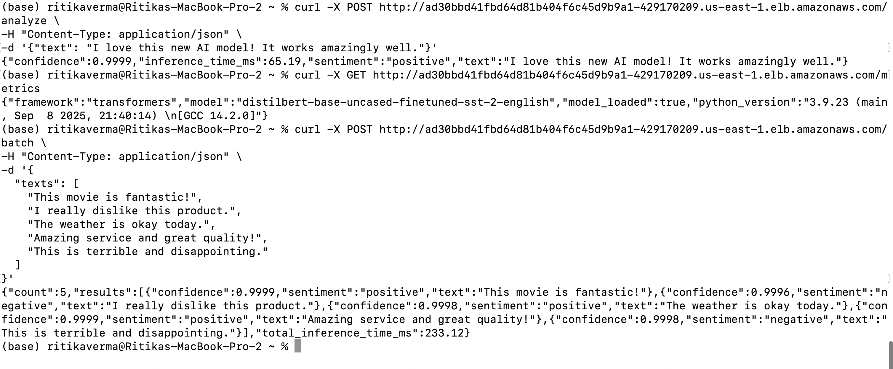
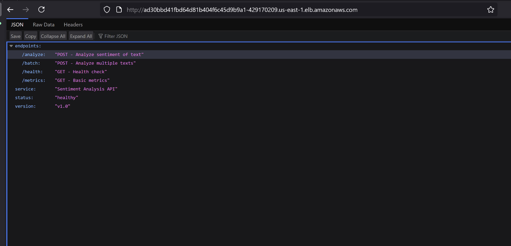

# AI Sentiment Analysis API - EKS Deployment

A proof-of-concept sentiment analysis API built with Flask and Hugging Face Transformers, deployed on AWS EKS to demonstrate ML model serving with Kubernetes best practices including autoscaling, rolling updates, and monitoring.

**⚠️ Important Note: This is a POC/Learning Project**

This project is designed for educational purposes and proof-of-concept demonstrations. It is **NOT production-ready** and lacks essential security features. Before using in any production environment, you must implement proper security measures including authentication, authorization, input validation, rate limiting, and network security.

## Features

- **Real-time sentiment analysis** using DistilBERT model
- **Batch processing** for multiple texts
- **Horizontal Pod Autoscaling** for handling variable loads
- **Rolling deployments** with zero downtime
- **Health checks** and monitoring
- **Load balancing** with AWS LoadBalancer
- **Resource management** optimized for ML workloads
- **API versioning** with detailed confidence analysis

## API Testing Results

### Terminal Testing

Successful API calls showing:
- Single text analysis returning positive sentiment (0.9999 confidence)
- Batch processing of 5 texts with mixed sentiments
- Fast inference times (65ms and 233ms total for batch)

### Browser Interface

Browser view of API root endpoint displaying:
- Healthy status
- Version v1.0
- All endpoints properly documented

## Architecture

┌─────────────────┐    ┌─────────────────┐    ┌─────────────────┐
│   Load Balancer │────│  EKS Cluster    │────│  ECR Registry   │
│                 │    │                 │    │                 │
│   External IP   │    │  ┌───────────┐  │    │  sentiment-api  │
└─────────────────┘    │  │    Pod    │  │    │     :v1.0       │
                       │  │  Flask+ML │  │    │     :v2.0       │
                       │  └───────────┘  │    └─────────────────┘
                       │  ┌───────────┐  │
                       │  │    Pod    │  │
                       │  │  Flask+ML │  │
                       │  └───────────┘  │
                       │                 │
                       │      HPA        │
                       └─────────────────┘

## Prerequisites
- AWS Account with EKS cluster
- Docker installed
- kubectl configured for your EKS cluster
- Helm 3.x installed
- AWS CLI configured

## Technology Stack

- **Backend**: Python 3.9, Flask
- **ML Framework**: Hugging Face Transformers (DistilBERT)
- **Containerization**: Docker
- **Orchestration**: Kubernetes (AWS EKS)
- **Package Manager**: Helm
- **Registry**: AWS ECR
- **Web Server**: Gunicorn

